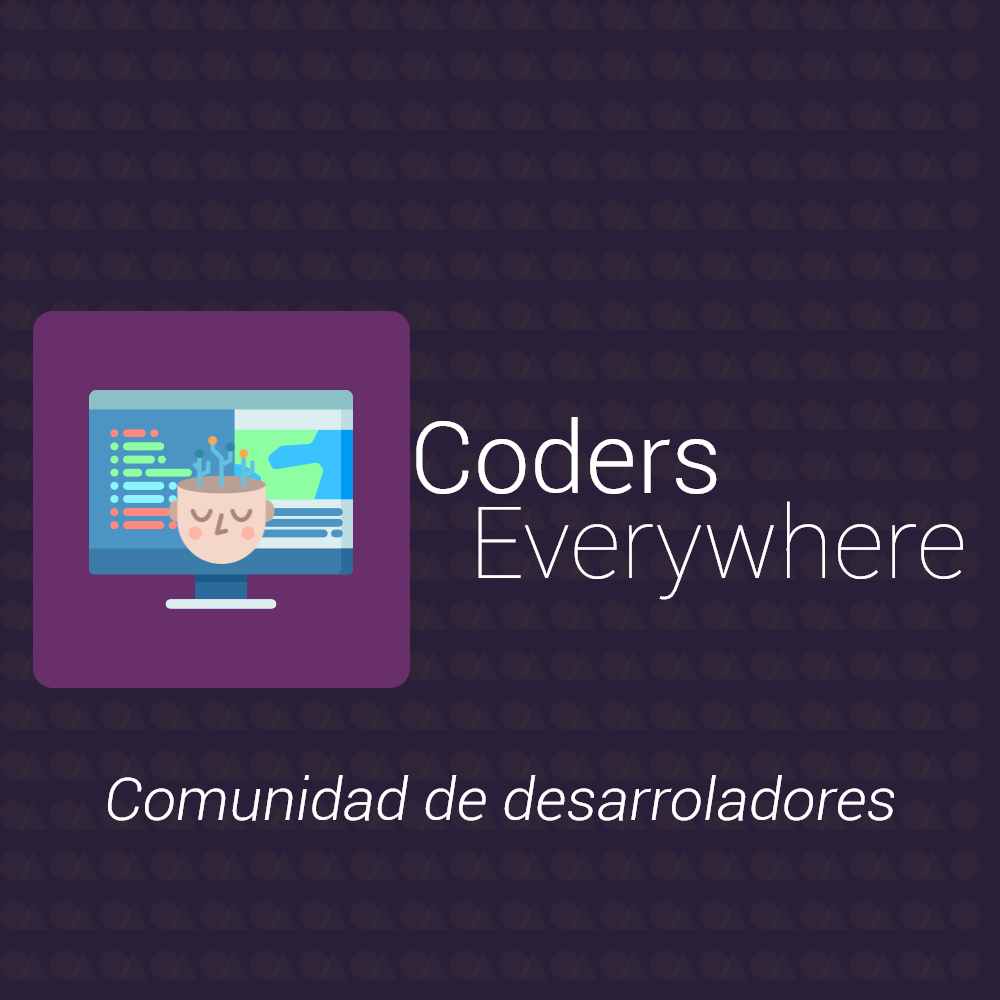

# Programación Orientada a Objetos

## Informacion base
Este repositorio contiene aplicaciones diversas todas con el uso de programación basada en objetos.
	
## Lenguajes usados
Desarrollado con:
* Java
* HTML5
* CSS3
* JS
* PHP

Desarrollado por: [Ángel Aguilar](https://twitter.com/devangelaguilar)

    

